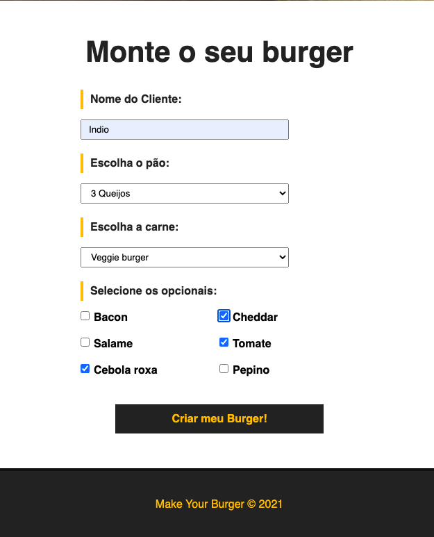
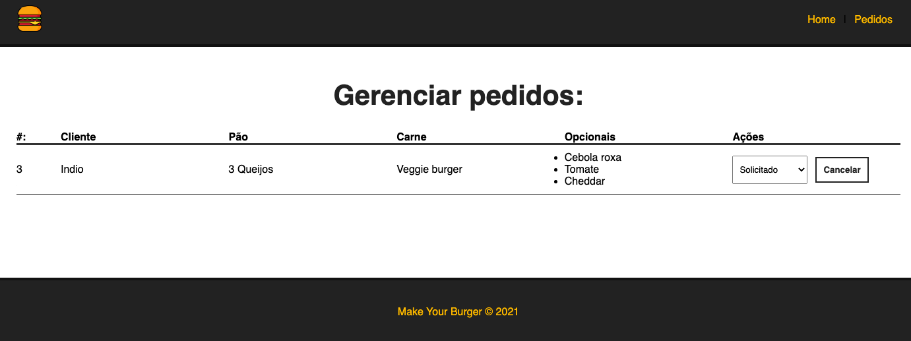
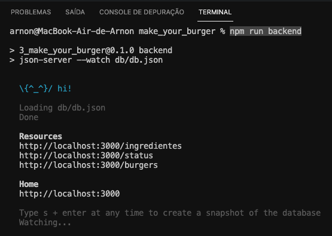
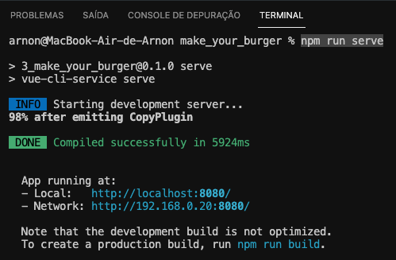

# Make Your Burger

> Projeto para gerencimento de pedidos de uma lanchonete.




## Project setup

```
npm install
```

### Compile and reload to run the backend

```
npm run backend
```



### Compiles and hot-reloads for development

```
npm run serve
```



### Compiles and minifies for production

```
npm run build
```

### Customize configuration

See [Configuration Reference](https://cli.vuejs.org/config/).
